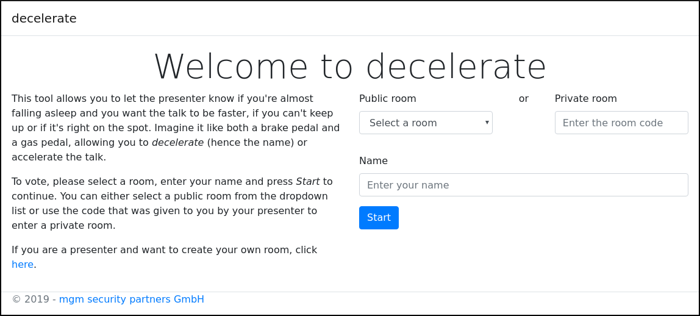
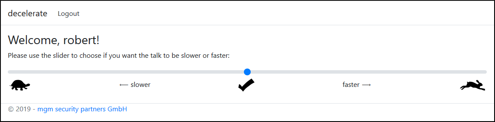
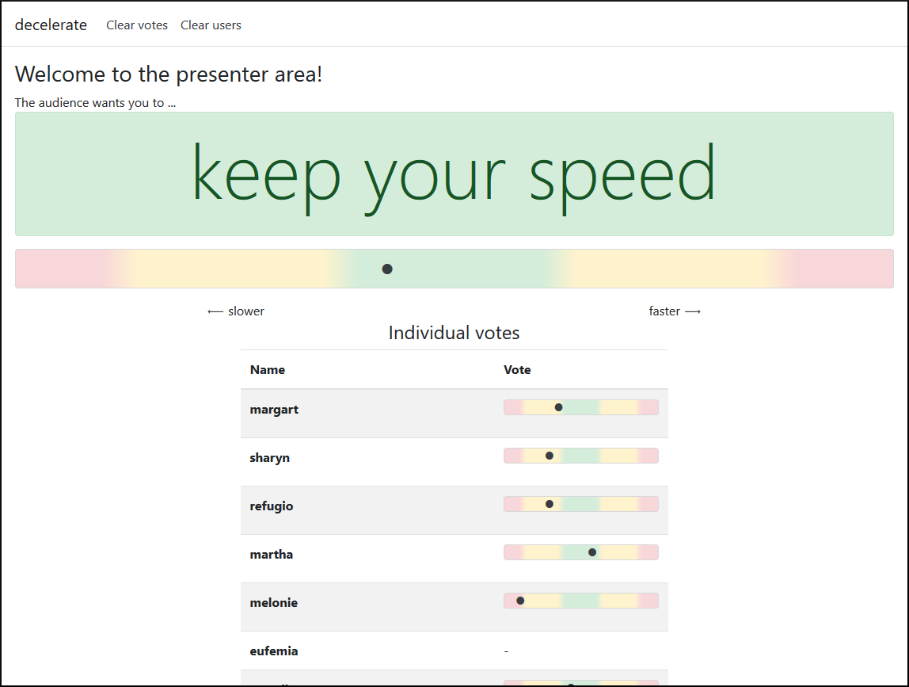

decelerate
==========

## Warning
:bangbang: This application purposely contains vulnerabilities. Use with caution!

## Description
This tool allows the audience to give feedback about the talking speed of a presenter.
Additionally, it serves as a demo application with vulnerabilities.

## Vulnerabilities
* JSON Web Tokens with signing algorithm `none` get accepted
* JWT Payload contains type information which is not validated before deserializing it
* WebSocket for presenter interface is accessible from arbitrary origins

The [attacks](attacks) directory contains instructions on how these vulnerabilities can be exploited.

## Configuration
Configuration is done in `decelerate/appsettings.json`.
* **Database ⇒ Connection**
    * path to the sqlite database
    * `Data Source=path/to/sqlite.db`
* **JwtKey**
  * key used for signing the JWTs
  * not a huge secret because unsigned JWTs are accepted anyway (as long as the algorithm is set to `none`,
    otherwise the signature is checked)
  * must be **exactly** 32 characters long
* **UserTimeoutSeconds**
  * time after which an inactive user gets logged out automatically (in seconds)
  * after automatic logout, the vote of the user is removed and the username is available again
* **Presenter ⇒ Username/Password**
  * username and password for the presenter area
  * you should **change the password** to prevent users from easily getting access to the votes and the
    “clear votes” / “clear users” functions
  * however, note that an attacker might get access to the votes via the WebSocket (which requires authentication
    but is not protected from cross-site requests) and can basically do anything using the deserialization
    vulnerability

## User Interface
When you visit the index page, you will see the following:

To use the application, you need to enter a name and press *Start*.
This reserves the entered name for you and logs you in.
However, after a certain time of inactivity or after you logged out, the name will be available again.
When you entered a name that isn't already reserved, you will see the following screen:

To vote, simply click on a position on the slider or drag it, more to the left if you want the talk to be slower
or more to the right if you want it to be faster.
You can logout using the link at the top of the page, but note that this will **remove your vote** and will make
your name available to use by anyone.

## Presenter Interface
The presenter interface is available at `http://your-hostname:port/PresenterArea`. 
After you entered the credentials configured in `decelerate/appsettings.json`, you will see the following page:

The large message box gives advice on your talking speed with one of these messages:
* talk much slower (red)
* talk a bit slower (yellow)
* keep your speed (green)
* talk a bit faster (yellow)
* talk much faster (red)

Which message is displayed depends on the average vote of all the users, which is also shown using the dot inside
the large red/yellow/green box below.
At the bottom of the page is a table which lists all the users and their individual votes.
Using the links at the top of the page you can reset all votes or delete all users.
The page is updated automatically each time a user logs in, votes or logs out.

## Todo List
* implement time decay for the votes?
