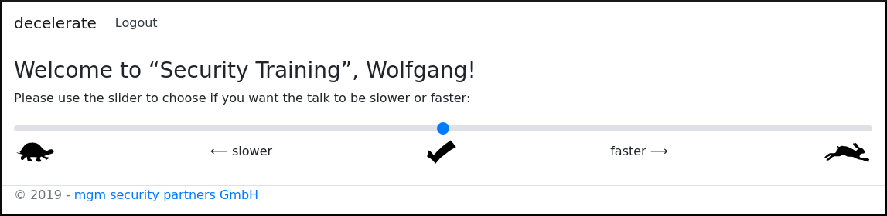
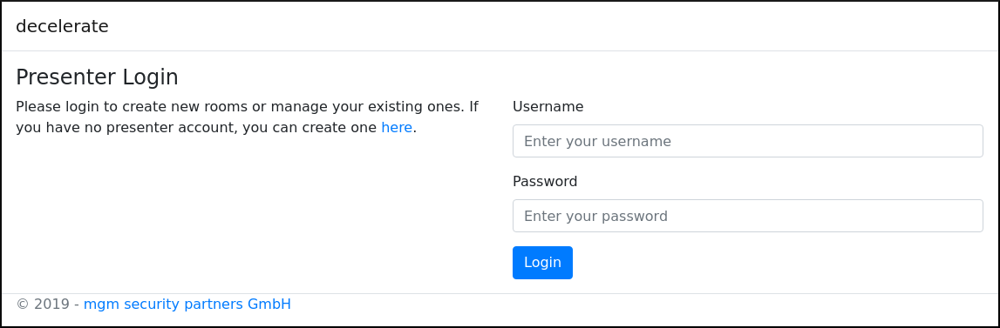
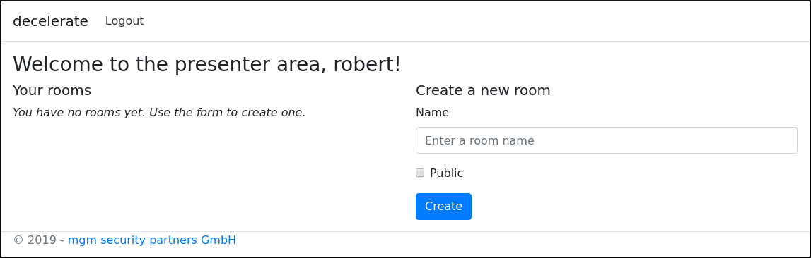

decelerate
==========
> :bangbang: **Warning:** This application purposely contains vulnerabilities. Use with caution!

## Description
This tool allows the audience to give feedback about the talking speed of a presenter.
Additionally, it serves as a demo application with vulnerabilities.
All information about the vulnerabilities and possible attacks is contained in the [attacks](attacks) directory,
the rest is kept spoiler-free.

## Configuration
Configuration is done in `decelerate/appsettings.json`.
* **Database ⇒ Connection**
    * path to the sqlite database
    * `Data Source=path/to/sqlite.db`
* **JwtKey**
  * key used for signing the JWTs
  * must be **exactly** 32 characters long
* **UserTimeoutSeconds**
  * time after which an inactive user gets logged out automatically (in seconds)
  * after automatic logout, the vote of the user is removed and the username is available again

## Docker Container
> :warning: **Note:** When you use the Docker container, restarting it wipes the complete database, i.e.
> presenters, rooms, users and votes are deleted.

To create the docker container, change into the `decelerate` directory and execute
```
docker build -t decelerate .
```

Afterwards, to start it on port `8080`, execute
```
docker run -p 8080:80 decelerate
```

## NinjaDVA Integration
> :warning: **Note:** This uses the Docker container, which means that restarting it wipes the complete database,
> i.e. presenters, rooms, users and votes are deleted.

1. Clone the NinjaDVA repository and change into the created directory:
```shell
git clone https://github.com/mgm-sp/NinjaDVA.git
cd NinjaDVA
```
2. Clone the decelerate repository into a directory named `decelerate_vm`:
```shell
git clone git@spcode.mgm-edv.de:NinjaDVA/decelerate.git decelerate_vm
```
3. Configure decelerate (change *JwtKey*):
```shell
vim decelerate_vm/decelerate/appsettings.json
```
4. Start NinjaDVA as usual:
```shell
./ninjadva up
```
5. The application is now available at `decelerate.your-domain.tld`.

To apply changes made to the application or the configuration, you need to trigger provisioning manually after
you started the VM:
```shell
cd decelerate_vm
vagrant provision
```

## User Interface
When you visit the index page, you will see the following:


To use the application as a presenter, click the link at the end of the text on the left and read the section
[below](#presenter-interface).

To use the application as a user, you need to select a room, enter a name and press *Start*.
All public rooms are listed in the dropdown menu on the left, but if you want to enter a private room you need to
ask your presenter for the admission code and enter it on the right.

Clicking *Start* reserves the entered name for this room and logs you in.
However, after a certain time of inactivity or after you logged out, the name will be available again.
When you entered a name that isn't already reserved, you will see the following screen:



To vote, simply click on a position on the slider or drag it, more to the left if you want the talk to be slower
or more to the right if you want it to be faster.
You can logout using the link at the top of the page, but note that this will **remove your vote** and will make
your name available to use by anyone.

## Presenter Interface
The presenter interface is available at `http://your-hostname:port/PresenterArea`. 
When you visit it for the first time, you will get redirected to the login form:



To create a presenter account, click the link on the left which leads you to the registration page:


After you registered, you get redirected to the presenter area:



You can use the form on the right to create a new room. Just enter a name, decide if the room should be public or
if the users need an admission code to enter the room and click *Create*.
This leads you to the room overview:


The large message box gives advice on your talking speed with one of these messages:
* “talk much slower” (red)
* “talk a bit slower” (yellow)
* “keep your speed” (green)
* “talk a bit faster” (yellow)
* “talk much faster” (red)

Which message is displayed depends on the average vote of all the users, which is also shown using the dot inside
the large red/yellow/green box below.
At the bottom of the page is a table which lists all the users and their individual votes.
The page is updated automatically each time a user logs in, votes or logs out.

Clicking “Manage Room” leads you to this page:


Here you can change name and protection of the room, delete all votes or users of the room, generate a new
admission code or delete the room completely.

Clicking “decelerate” in the left upper corner of the screen always leads you back to the main page of the
presenter area, which now lists your newly created room:


Here you can copy the admission codes for your rooms and go to the individual room overviews by clicking on the
name of the room you want to see.

## Todo List
* slides
* access attacker websites automatically
* JoinRoom for the correct room returns the flag?
